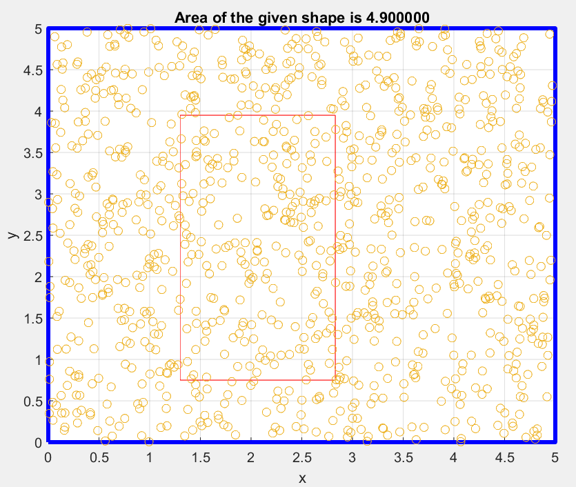
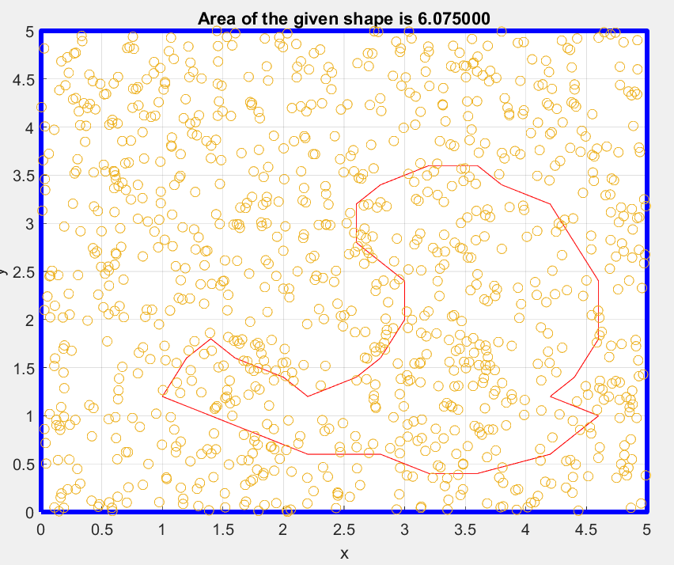
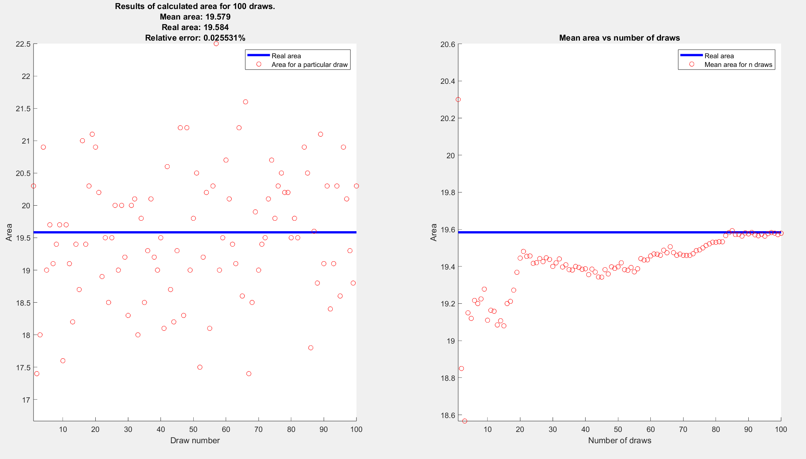
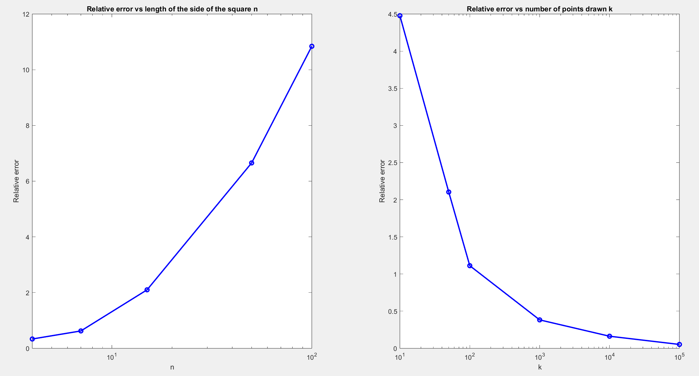

## Monte Carlo Area Estimator
The project was created for the Numerical Methods course at my University.  
**The goal** of the task was to create an algorithm in MATLAB that estimates the area of any planar figure defined by a set of points.
To achieve this, it was necessary to create a square area with side length $n$
n in which points would be randomly generated.  
After generating the points, it was required to analyze how many points lie inside the figure whose area needs to be determined, and then compute the area using the following formula:  
$P=\frac{pn}{k} \times n^2$  
where:  
$pn$ - the number of points inside the figure 
$k$ - the total number of points  
$n$ - the side length of the square 

### Technologies
* Matlab

### Features
* Display the shape and drawn points
* Estimate the area 
* Generate plots presenting the mean area after many drawns
* Display the relative error plots

### Setup and usage
After downloading the repository one should simply run it in Matlab. It is possible to play with the hyperparameters like $n$ and $k$ as well as the figure itself.

### Results of the scripts:
`SingleAreaPresenter`  
Below are displayed the results of the first script. The first one is for the rectangle of known area of 4.896  
  
The second one is for an irregular shape:  
  

`ApproxAreaCalculator`
This script generates the following plots for the given number of draws. The first one presents the area estimated for each draw and the second one presents the mean area after a particular number of draws.
  

`ErrorPlots` 
Those plots represent the relation between increased the relative error and $n$ and $k$. It can be seen that when $n$ increases the error also increases and when $k$ increases the error $decreases$. 
